This folder contains images of the different PCBs for reference.
The photo of the product has been generated using Google gemini.

Ce dossier contient des images des différents circuits pour référence.
La photo du produit a été généré par Google gemini.

  VOICE ASSISTANT - ASSISTANT VOCAL
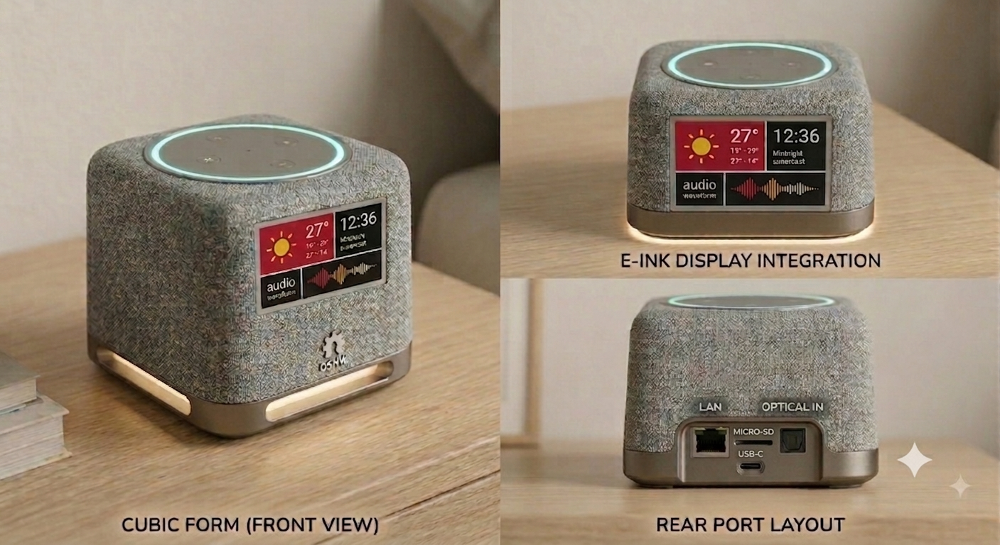

Brain_bottom-Cerveau_dessus
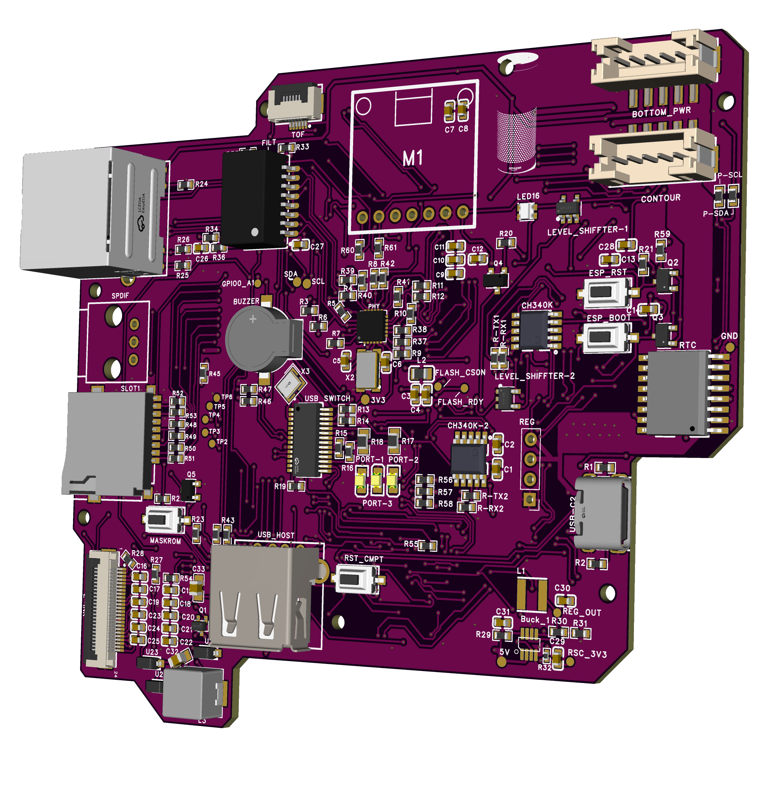

Brain_bottom-Cerveau_dessous
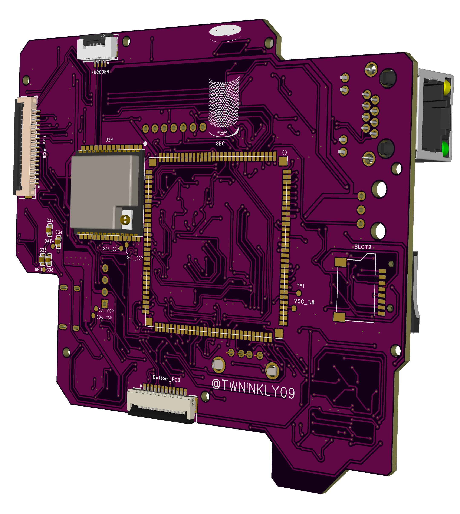

Brain_bottom_connectors
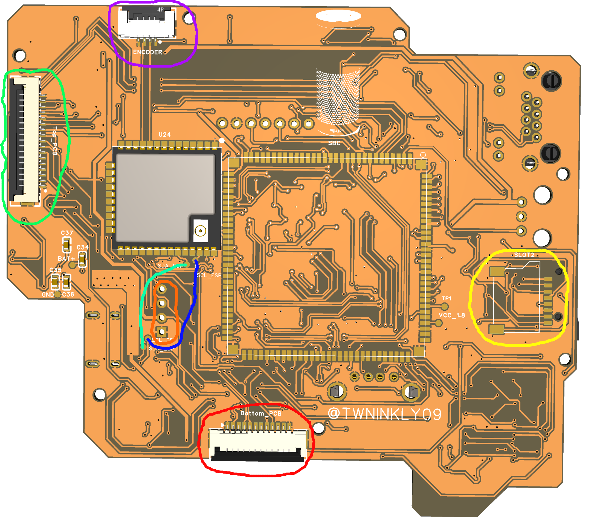

Brain_front_connectors
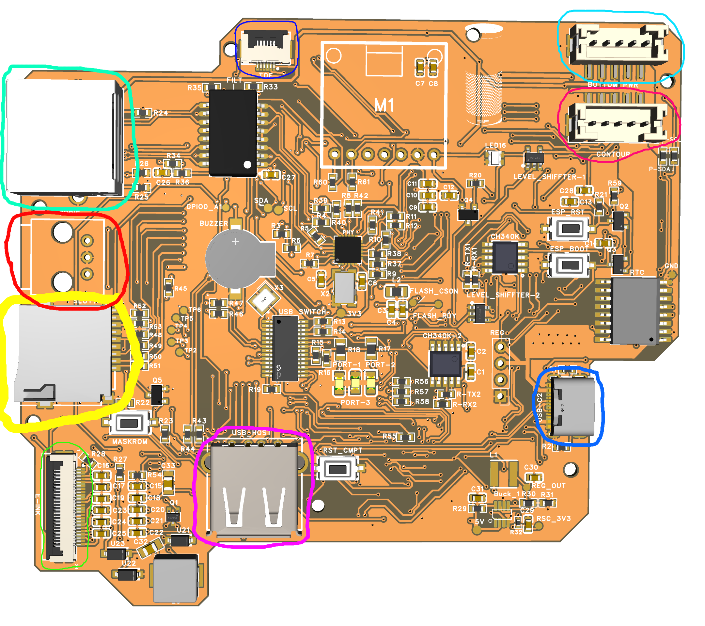

Bottom_top-Bas_dessus
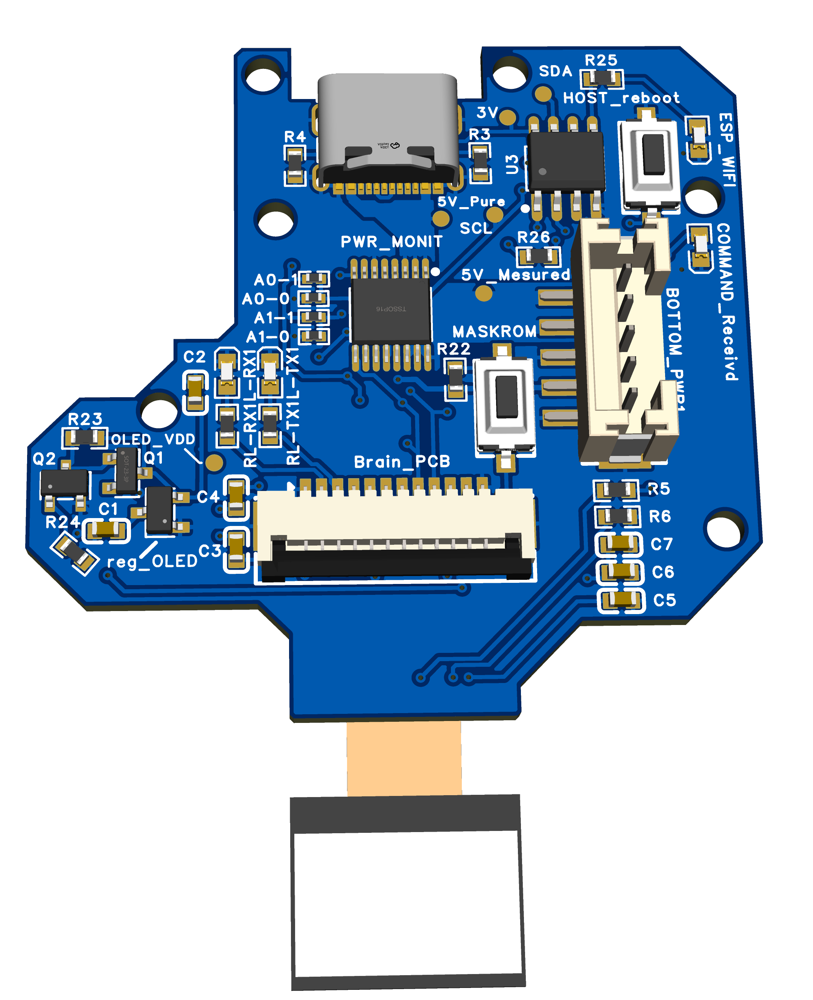

Bottom_underside-Bas_dessous

Top_topside-Dessus_superieure
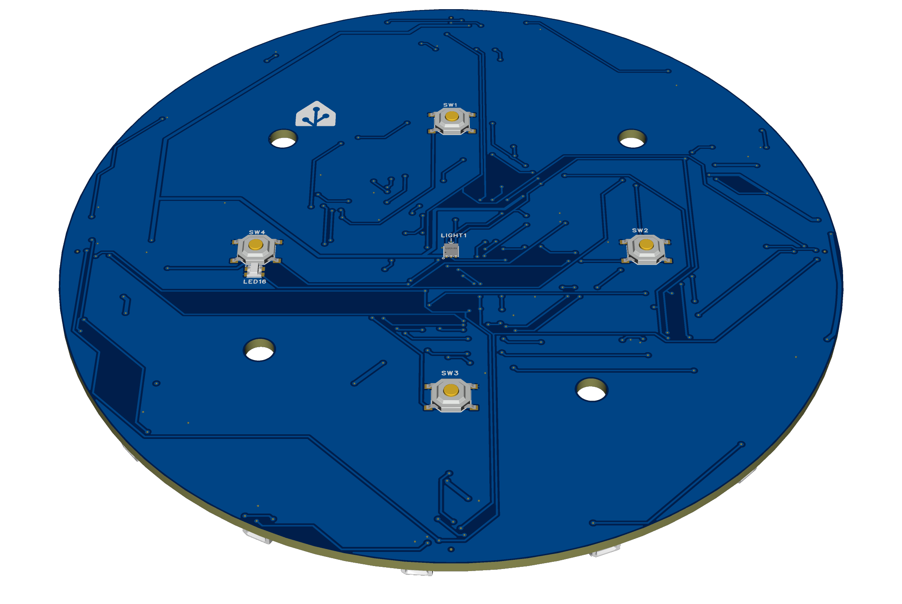

Top_underside-Dessous_inferieure
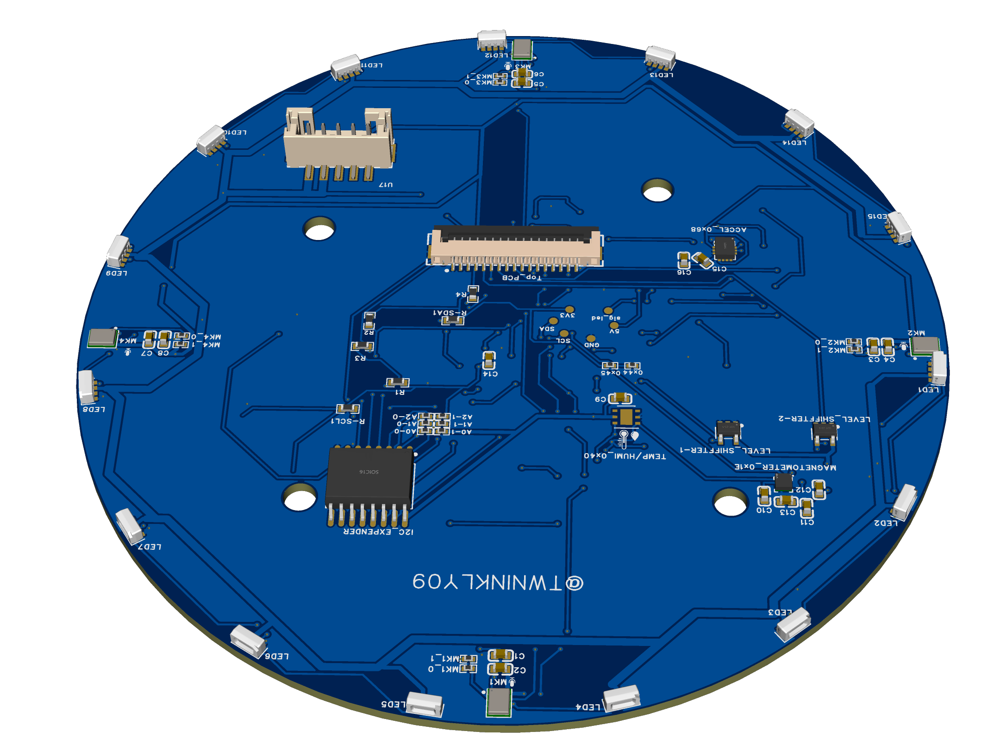

Contour_bottom-dessus
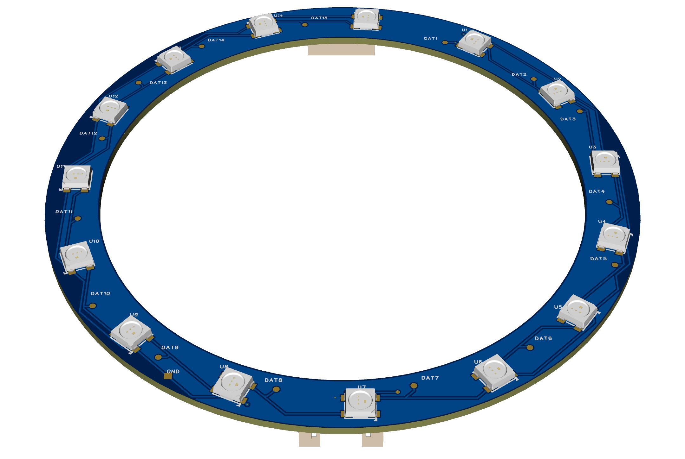

Contour_-dessous
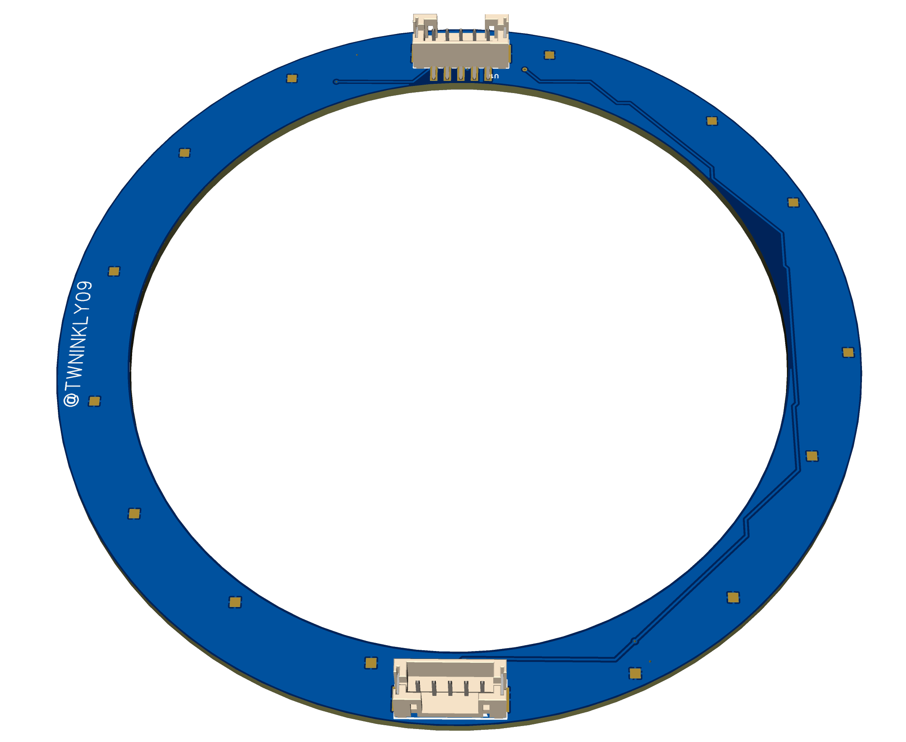

Front_bottom-Face_dessus
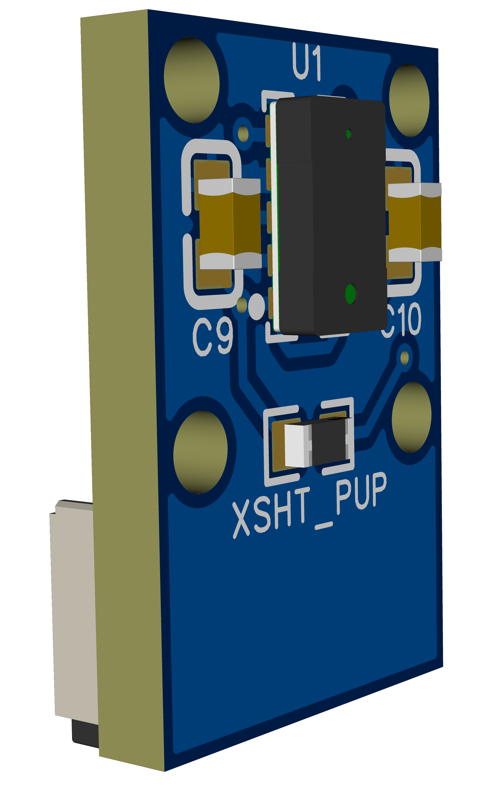

Front_bottom-Face_dessous
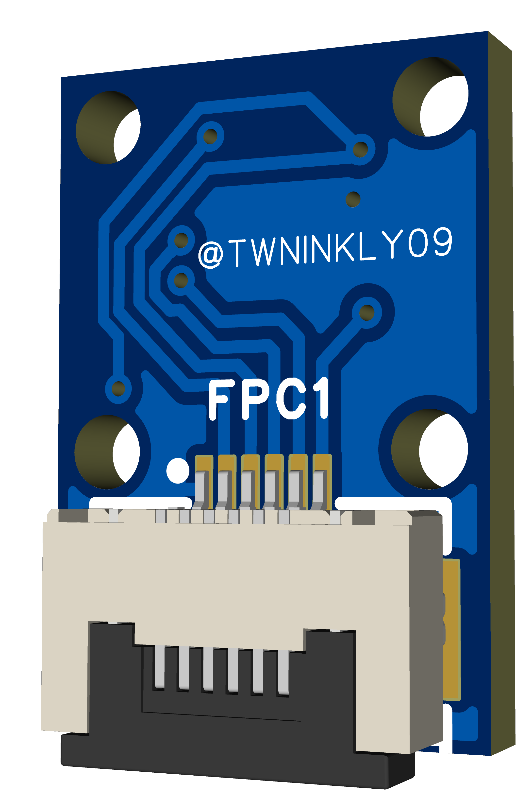
