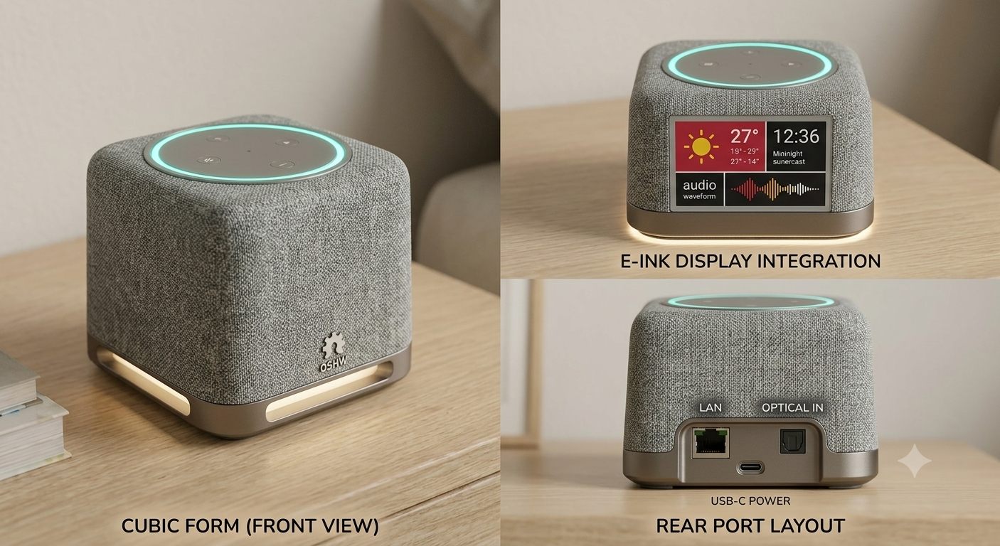

# 🎙️ Voice Assistant — Open Hardware


This image has been generated by gemini


> **⚠️ Work in progress / En cours de développement**
> 
> Hardware is being validated, software is not yet functional end-to-end.
> **3D enclosure files are not yet available** — mechanical design is still in progress.
>
> Le hardware est en cours de validation, le software n'est pas encore fonctionnel de bout en bout.
> **Les fichiers 3D du boîtier ne sont pas encore disponibles** — le design mécanique est en pleine phase de conception.


---

## 🤝 Contributing / Contribuer

**All contributions are welcome**, especially on the software side:
- Linux device tree tuning (I2S, GMAC, SPI)
- Audio pipeline (ALSA / PipeWire, wake-word detection)
- ESP32 firmware (I2C coprocessor, peripheral management)
- Driver integration for sensors (BMI160, LIS2MDL, VL53L0, OPT3001…)
- Any experience with RK3308 / Radxa rCore on mainline kernel

Feel free to open an issue or a pull request. Even feedback or questions are helpful at this stage.

**Toutes les contributions sont les bienvenues**, en particulier côté software :
- Tuning du device tree Linux (I2S, GMAC, SPI)
- Pipeline audio (ALSA / PipeWire, détection de mot de réveil)
- Firmware ESP32 (coprocesseur I2C, gestion des périphériques)
- Intégration des drivers capteurs (BMI160, LIS2MDL, VL53L0, OPT3001…)
- Toute expérience avec RK3308 / Radxa rCore sur kernel mainline

N'hésite pas à ouvrir une issue ou une pull request. Même un retour ou une question est utile à ce stade.

---

## 📸 Photos

> *Photos coming soon — PCB is being assembled.*
> *Photos à venir — le PCB est en cours d'assemblage.*

<!-- Une fois les photos disponibles, les mettre dans le dossier images/ et décommenter :


-->

---

## 🧠 What is this? / C'est quoi ?

This is an **open-hardware embedded voice assistant** built around the **Radxa rCore module (Rockchip RK3308B)**, running Linux on a custom multi-layer PCB stack. The system captures voice through a 4-microphone MEMS array, processes audio in real time under Linux, and delivers audio output via an I2S Class-D amplifier. Network connectivity (Ethernet + WiFi/BT) enables access to cloud services or a local backend.

C'est un **assistant vocal embarqué open hardware** construit autour du module **Radxa rCore (Rockchip RK3308B)**, sous Linux sur un stack de PCB custom multi-couches. Le système capture la voix via 4 microphones MEMS, traite le signal audio en temps réel sous Linux, et restitue la réponse via un ampli DAC I2S. La connectivité réseau (Ethernet + WiFi/BT) permet l'accès à des services cloud ou à un backend local.

---

## 🗂️ Hardware Architecture / Architecture matérielle

```
┌─────────────────────────────────────────────┐
│           PCB Cerveau (main board)           │
│  rCore RK3308B · ESP32 · RTC · USB · ETH    │
└────────┬──────────────┬───────────────┬──────┘
         │ FPC 17P      │ FPC 12P       │ FPC 5P
    ┌────┴────┐    ┌────┴────┐    ┌─────┴────┐
    │  Dessus │    │ Dessous │    │ Contour  │
    │  (Top)  │    │(Bottom) │    │ RGB LEDs │
    └────┬────┘    └─────────┘    └──────────┘
         │ FPC 6P
    ┌────┴────┐
    │  Avant  │
    │ (Front) │
    │   ToF   │
    └─────────┘
```

---

## 🖥️ PCB Cerveau — Main Board

### Compute

| Component | Part | Description |
|---|---|---|
| **SOM** | Radxa rCore (RK3308B) | Quad-core ARM Cortex-A35 @ 1.3GHz, 512MB DDR3, 8GB eMMC |
| **Coprocessor** | ESP32-WROOM-32U-N4 | WiFi 802.11b/g/n + BT 4.2 MCU, connected via I2C1 to RK3308B |

| Composant | Réf. | Description |
|---|---|---|
| **SOM** | Radxa rCore (RK3308B) | Module quad-core ARM Cortex-A35 @ 1.3GHz, 512MB DDR3, 8GB eMMC |
| **Coprocesseur** | ESP32-WROOM-32U-N4 | Microcontrôleur WiFi 802.11b/g/n + BT 4.2, connecté via I2C1 au RK3308B |

### Displays / Afficheurs

| Component | Part | Interface | Description |
|---|---|---|---|
| **eInk 2.9"** | Waveshare 2.9" G | SPI2 | e-Paper display 296×128px, FPC 24P connector, ultra low power |
| **OLED 0.49"** | Wisevision X049-6432TSWPG02-H14 | I2C | OLED display 64×32px (on Bottom PCB) |

| Composant | Réf. | Interface | Description |
|---|---|---|---|
| **eInk 2.9"** | Waveshare 2.9" G | SPI2 | Écran e-paper 296×128px, connecteur FPC 24P, très faible consommation |
| **OLED 0.49"** | Wisevision X049-6432TSWPG02-H14 | I2C | Écran OLED 64×32px (sur PCB Dessous) |

### Network / Connectivité réseau

| Component | Part | Description |
|---|---|---|
| **Ethernet PHY** | Microchip LAN8720A | RMII 10/100Mbps PHY, MDIO addr 0x01, 50MHz REFCLK from SoC, reset GPIO0_B7 |
| **ETH transformer** | PULSE HX1188NL | Integrated magnetic filter, coupled to RJ45 |

| Composant | Réf. | Description |
|---|---|---|
| **PHY Ethernet** | Microchip LAN8720A | PHY RMII 10/100Mbps, adresse MDIO 0x01, REFCLK 50MHz généré par le SoC, reset GPIO0_B7 |
| **Transformateur ETH** | PULSE HX1188NL | Filtre magnétique Ethernet intégré, couplé au RJ45 |

### USB & Serial / USB & Interfaces série

| Component | Part | Description |
|---|---|---|
| **USB-UART #1** | WCH CH340K | USB to UART bridge for ESP32 programming and debug |
| **USB-UART #2** | WCH CH340K | USB to UART bridge for RK3308B Linux console (UART0) |
| **USB Hub** | Terminus FE1.1S | USB 1.1 hub BSOP28 |

| Composant | Réf. | Description |
|---|---|---|
| **USB-UART #1** | WCH CH340K | Pont USB-UART pour programmation et debug de l'ESP32 |
| **USB-UART #2** | WCH CH340K | Pont USB-UART pour console debug Linux du RK3308B (UART0) |
| **USB Hub** | Terminus FE1.1S | Hub USB 1.1 BSOP28 |

### Timekeeping & Power / Temps réel & Alimentation

| Component | Part | Description |
|---|---|---|
| **RTC** | NXP PCF2129T | I2C real-time clock with battery backup, SO-16 |
| **Buck converter** | MP2161 | DC/DC step-down converter TSOT23-8 |
| **Buzzer** | MLT-9032 | SMD piezo buzzer 9×3mm |

| Composant | Réf. | Description |
|---|---|---|
| **RTC** | NXP PCF2129T | Horloge temps réel I2C avec backup batterie, SO-16 |
| **Buck converter** | MP2161 | Convertisseur abaisseur DC/DC TSOT23-8 |
| **Buzzer** | MLT-9032 | Buzzer piézo SMD 9×3mm |

### Discrete actives / Discrets actifs

| Component | Part | Role |
|---|---|---|
| N-MOSFET | BSS138 ×2 | Logic level shifting |
| 3-state buffer | 74AHCT1G125GV ×2 | 5V↔3.3V level shifter |
| P-MOSFET | SI1308EDL | Power switching |
| NPN BJT | MMBT3904 ×2 | Signal driving |
| Schottky diode | MBR0530 ×3 | Protection / rectification |

| Composant | Réf. | Rôle |
|---|---|---|
| MOSFET N | BSS138 ×2 | Adaptation de niveaux logiques |
| Buffer 3 états | 74AHCT1G125GV ×2 | Level shifter 5V↔3.3V |
| MOSFET P | SI1308EDL | Commutation alimentation |
| BJT NPN | MMBT3904 ×2 | Pilotage signaux |
| Diode Schottky | MBR0530 ×3 | Protection / redressement |

### Oscillators / Oscillateurs

| Component | Frequency | Use |
|---|---|---|
| SMD Crystal | 25 MHz | Ethernet PHY reference |
| SMD Crystal | 12 MHz | CH340K reference |

| Composant | Fréquence | Usage |
|---|---|---|
| Quartz SMD | 25 MHz | Référence PHY Ethernet |
| Quartz SMD | 12 MHz | Référence CH340K |

---

## 🔊 PCB Dessus (Top) — Audio & Sensors / Audio & Capteurs

### Audio

| Component | Part | Description |
|---|---|---|
| **MEMS Mic ×4** | Knowles SPH0645LM4H-B-8 | Digital I2S 24-bit MEMS microphones, 4 independent channels (SDI0–SDI3 on I2S0) |
| **DAC Amplifier** | Maxim MAX98357A | Class-D mono I2S amplifier 3.2W, enable via GPIO0_B2 |

| Composant | Réf. | Description |
|---|---|---|
| **Micro MEMS ×4** | Knowles SPH0645LM4H-B-8 | Microphones MEMS numériques I2S 24 bits, 4 canaux indépendants (SDI0–SDI3 sur I2S0) |
| **Ampli DAC** | Maxim MAX98357A | Ampli classe D mono I2S 3.2W, enable via GPIO0_B2 |

### Environmental sensors / Capteurs environnementaux

| Component | Part | Interface | Description |
|---|---|---|---|
| **6-axis IMU** | Bosch BMI160 | I2C/SPI | Accelerometer + gyroscope, addr 0x68 |
| **Magnetometer** | ST LIS2MDLTR | I2C | 3-axis magnetometer, addr 0x1E |
| **Ambient light** | TI OPT3001DNPR | I2C | Calibrated lux sensor, visible spectrum |
| **Temp/Humidity** | TI HDC1080DMBR | I2C | Temperature + relative humidity, addr 0x40 |

| Composant | Réf. | Interface | Description |
|---|---|---|---|
| **IMU 6 axes** | Bosch BMI160 | I2C/SPI | Accéléromètre + gyroscope, adresse 0x68 |
| **Magnétomètre** | ST LIS2MDLTR | I2C | Magnétomètre 3 axes, adresse 0x1E |
| **Lumière ambiante** | TI OPT3001DNPR | I2C | Capteur lux calibré spectre visible |
| **Temp/Humidité** | TI HDC1080DMBR | I2C | Température + humidité relative, adresse 0x40 |

### GPIO & LEDs

| Component | Part | Description |
|---|---|---|
| **I2C GPIO expander** | TI PCA9554DW | 8-bit I2C GPIO expander SOIC-16 |
| **Level shifter** | 74AHCT1G125GV ×2 | 3-state buffer 5V↔3.3V |
| **RGB LED** | Worldsemi WS2812B-2020 ×1 | Addressable RGB LED 2×2mm |
| **RGB LED array** | Worldsemi WS2812C-4020 ×15 | Addressable RGB LEDs 4×2mm |

| Composant | Réf. | Description |
|---|---|---|
| **I2C GPIO expander** | TI PCA9554DW | Expander I2C 8 bits SOIC-16 |
| **Level shifter** | 74AHCT1G125GV ×2 | Buffer 3 états 5V↔3.3V |
| **LED RGB** | Worldsemi WS2812B-2020 ×1 | LED RGB adressable 2×2mm |
| **LED RGB array** | Worldsemi WS2812C-4020 ×15 | LEDs RGB adressables 4×2mm |

---

## 📟 PCB Dessous (Bottom) — Power & Interface

| Component | Part | Interface | Description |
|---|---|---|---|
| **Power monitor** | TI INA260AIPW | I2C | Voltage/current/power measurement TSSOP-16 |
| **I2C GPIO expander** | NXP PCA9536D | I2C | 4-bit I2C GPIO expander SOIC-8 |
| **OLED LDO** | TOREX XC6206P402MR | — | 4.0V dedicated regulator for OLED |
| **P-MOSFET** | FDN338P | — | Power switching |
| **N-MOSFET** | FDN335N | — | Signal switching |

| Composant | Réf. | Interface | Description |
|---|---|---|---|
| **Moniteur puissance** | TI INA260AIPW | I2C | Mesure tension/courant/puissance TSSOP-16 |
| **I2C GPIO expander** | NXP PCA9536D | I2C | Expander I2C 4 bits SOIC-8 |
| **LDO OLED** | TOREX XC6206P402MR | — | Régulateur 4.0V dédié alimentation OLED |
| **MOSFET P** | FDN338P | — | Commutation alimentation |
| **MOSFET N** | FDN335N | — | Commutation signal |

---

## 📡 PCB Avant (Front) — Proximity / Détection de proximité

| Component | Part | Interface | Description |
|---|---|---|---|
| **ToF sensor** | ST VL53L0CXV0DH/1 | I2C | Laser Time-of-Flight rangefinder, 2m range, 12P LGA |

| Composant | Réf. | Interface | Description |
|---|---|---|---|
| **Capteur ToF** | ST VL53L0CXV0DH/1 | I2C | Télémètre laser Time-of-Flight, portée 2m, 12P LGA |

---

## 💡 PCB Contour — RGB Ring / Anneau LED

| Component | Part | Description |
|---|---|---|
| **Addressable RGB LED ×15** | SK6812 | 5×5mm RGB LEDs, decorative / status ring |

| Composant | Réf. | Description |
|---|---|---|
| **LED RGB adressable ×15** | SK6812 | LEDs RGB 5×5mm, anneau décoratif / status |

---

## 🔌 Software interfaces / Interfaces logicielles

| Interface | Bus | Connected to / Périphériques |
|---|---|---|
| I2S0 Master | GPIO2 | MAX98357A (SDO0) + 4× SPH0645 (SDI0–3) |
| SPDIF TX | GPIO0_C1 | Digital audio output / Sortie audio numérique |
| GMAC RMII | GPIO1_B4→C5 | LAN8720A |
| SPI2 | GPIO1_C6/C7/D0/D1 | eInk 2.9" 296×128px |
| I2C1 | GPIO0_B3/B4 | ESP32 |
| I2C2 | GPIO2_A2/A3 | BMI160, LIS2MDL, OPT3001, HDC1080, INA260, PCA9554, PCA9536, VL53L0, OLED 0.49" |
| UART0 | GPIO2_A0/A1 | Linux debug console / Console debug Linux |
| GPIO | GPIO0 divers | LEDs, buttons, MAX98357A enable, PHY reset |

---

## 🗂️ Repository structure / Structure du dépôt

```
├── hardware/
│   └── rk3308-custom-pcb.dts    # Linux device tree overlay
├── bom/
│   ├── BOM_Cerveau.xlsx
│   ├── BOM_Dessus.xlsx
│   ├── BOM_Dessous.xlsx
│   ├── BOM_Avant.xlsx
│   └── BOM_Contour.xlsx
├── images/
│   └── (photos coming soon / photos à venir)
├── LICENSE                       # MIT (software)
├── LICENSE-HARDWARE              # CERN-OHL-P v2 (hardware)
└── README.md
```

---

## 🔧 Software environment / Environnement logiciel

**EN:** Debian Linux image (Radxa Pi S0 base), Linux 5.x BSP Rockchip kernel (modified), ALSA / PipeWire audio stack, custom device tree overlay.

**FR:** Image Debian Linux (base Radxa Pi S0), kernel Linux 5.x BSP Rockchip (modifié), stack audio ALSA / PipeWire, overlay device tree custom.

---

## ⚠️ Development notes / Notes de développement

**EN:**
> Hardware validation in progress. Key points to verify at first boot:
> - SPH0645 1-bit offset (non-standard Philips I2S format)
> - LAN8720A REFCLK direction (`clock_in_out = "output"`)
> - PHY MDIO address (0x01 via PHYAD0/RXER 10kΩ pull-up)
> - I2C addresses: BMI160 0x68 · LIS2MDL 0x1E · OPT3001 configurable · HDC1080 0x40 · INA260 configurable · VL53L0 0x29

**FR:**
> Validation hardware en cours. Points à vérifier au premier boot :
> - Décalage 1 bit SPH0645 (format Philips I2S non standard)
> - Direction REFCLK LAN8720A (`clock_in_out = "output"`)
> - Adresse MDIO PHY (0x01 via PHYAD0/RXER pull-up 10kΩ)
> - Adresses I2C : BMI160 0x68 · LIS2MDL 0x1E · OPT3001 configurable · HDC1080 0x40 · INA260 configurable · VL53L0 0x29
